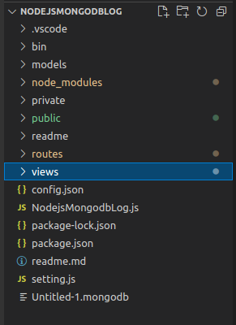
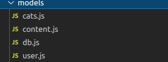
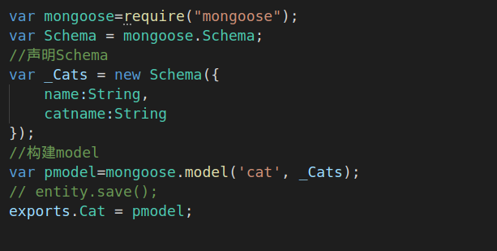
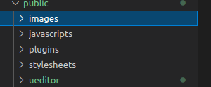
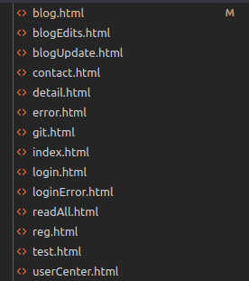
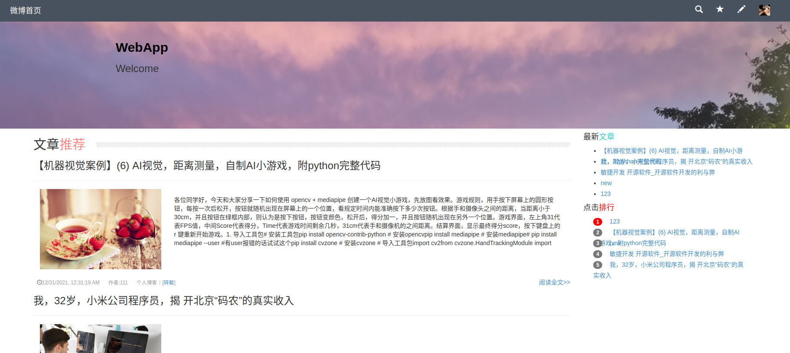
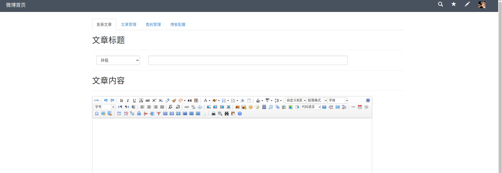
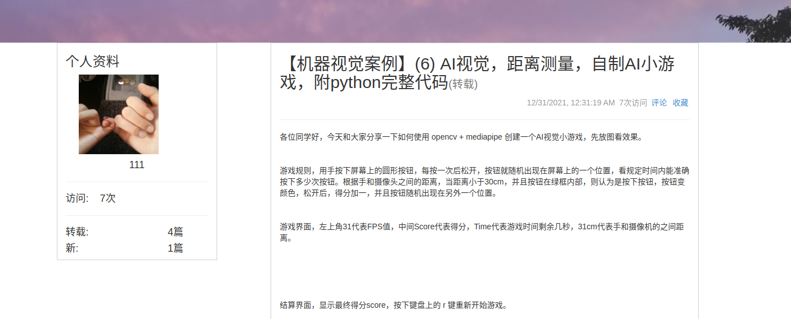

# 个人博客系统

## 一.项目总体构成

### 1.models

声明Schema

### 2.public

包含一些图片样式以及UE编辑器

### 3.routes

包含主要方法

### 4.views

包含网页

## 2.使用说明

进入博客后可以选择注册登陆来编辑个人信息，可以在博客首页观看文章推荐。

在右上角编辑栏内可以是实现各个功能

可以在搜索栏内搜索文章或作者

阅读全文页面对于读者和作者作了区分

评论功能尚未实现

3.开发日记

2021.12.31完成部分